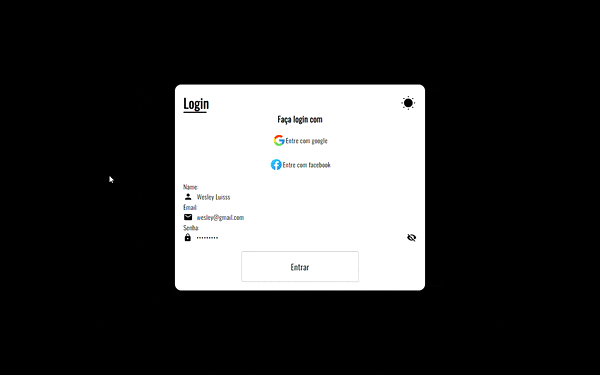

# Light-Dark-Theme-Login

Página estática construída somente para aprendizado, nessa página é possível que o usuário clique em um botão para mudar entre os temas Dark e Light.

# Demonstração

📚 Funcionalidades

- [x] Transição de temas após o usuário clicar no ícone que representa um sol.
- [x] Mostrar senha que o usuário digitou quando ele clicar no ícone (Olho).

🔨 TECNOLOGIAS

Esse projeto foi desenvolvido com as seguintes tecnologias:

✔️ HTML

✔️ CSS

✔️ JavaScript